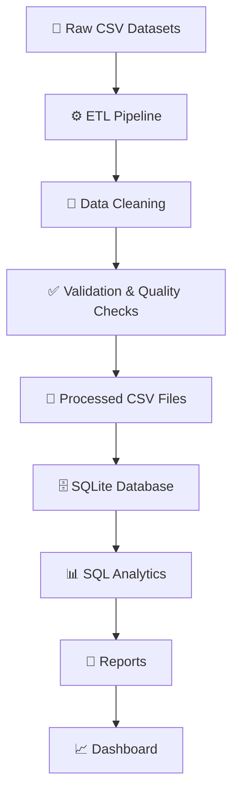

<p align="center">
  
</p>

<p align="center">


</p>

<h1 align="center">FundSight</h1>

<p align="center">
Mutual Fund Analytics Platform
</p>

<p align="center">
<i>Transforming Financial Data into Actionable Insights</i>
</p>

FundSight is an end-to-end mutual fund analytics platform that ingests, cleans, validates, stores, and analyzes financial datasets. The project implements a modular ETL pipeline, SQLite-based analytical database, SQL reporting, and dashboard-ready datasets to generate meaningful investment insights.

---

## 💡 Why FundSight?

FundSight demonstrates an end-to-end data engineering workflow for mutual fund analytics. The project showcases how raw financial datasets can be transformed into reliable, analysis-ready data using ETL principles, SQL-based reporting, and modular data architecture.

---

## ✨ Key Highlights

- 📈 End-to-end ETL pipeline for mutual fund analytics
- 🧹 Automated data cleaning and validation using Pandas
- 🗄️ SQLite analytical data warehouse with star schema
- 📊 SQL-based financial analytics and reporting
- 📉 Dashboard-ready datasets for visualization

---

# 🚀 Features

* ✅ Automated data ingestion pipeline
* ✅ Data cleaning and preprocessing using Pandas
* ✅ SQLite database integration
* ✅ Star schema database design
* ✅ Analytical SQL queries
* ✅ Data quality validation
* ✅ ETL verification and row count checks
* ✅ Dashboard-ready datasets
* ✅ Automated analytics report generation

---

# 🏛️ System Architecture



This project follows a modular ETL architecture. Raw mutual fund datasets are ingested, cleaned, validated, and transformed into processed datasets before being loaded into a SQLite analytical database. SQL queries generate business insights that power reporting modules and provide the foundation for future interactive dashboards.

---

# 📂 Project Structure

```text
fundsight-mutual-fund-analytics/
│
├── dashboard/
│   ├── charts.py
│   └── ...
│
├── data/
│   ├── raw/
│   │   ├── 01_fund_master.csv
│   │   ├── 02_nav_history.csv
│   │   ├── ...
│   │
│   └── processed/
│       ├── clean_nav.csv
│       ├── clean_transactions.csv
│       └── clean_performance.csv
│
├── docs/
│   ├── data_dictionary.md
│   ├── data_quality_summary.md
│   └── day1_todo.md
│
├── etl/
│   ├── data_ingestion.py
│   ├── clean_nav.py
│   ├── clean_transactions.py
│   ├── clean_performance.py
│   ├── load_to_sqlite.py
│   ├── verify_row_counts.py
│   └── check_db.py
│
├── reports/
│   ├── analytics.py
│   ├── sql_queries.sql
│   ├── top_alpha.csv
│   ├── top_sharpe.csv
│   ├── investor_demographics.csv
│   ├── gender_distribution.csv
│   └── state_investment.csv
│
├── sql/
│   ├── schema.sql
│   └── star_schema.sql
│
├── fundsight.db
├── requirements.txt
└── README.md
```

---

# 🔄 ETL Workflow

```text
Raw Mutual Fund Data
        │
        ▼
Data Ingestion
        │
        ▼
Data Cleaning & Validation
        │
        ▼
Processed CSV Files
        │
        ▼
SQLite Database
        │
        ▼
Analytical SQL Queries
        │
        ▼
Analytics Reports
        │
        ▼
Dashboard Visualizations
```

---

# 🛠️ Tech Stack

| Category              | Technology            |
| --------------------- | --------------------- |
| Programming Language  | Python 3              |
| Data Processing       | Pandas                |
| Database              | SQLite                |
| ORM / Database Access | SQLAlchemy            |
| Data Analysis         | SQL                   |
| Visualization         | Matplotlib            |
| Dashboard             | Streamlit *(planned)* |
| Documentation         | Markdown              |
| Version Control       | Git & GitHub          |

---

# 📊 Current Progress

## ✅ Phase 1 — Data Ingestion

* Raw mutual fund datasets collected
* Dataset profiling completed
* Data ingestion pipeline implemented

---

## ✅ Phase 2 — ETL & Database

* Cleaned NAV history
* Cleaned investor transactions
* Cleaned scheme performance
* Implemented business rule validations
* KYC validation
* Expense ratio validation
* Anomaly detection
* SQLite database creation
* Star schema design
* Row count verification

---

## ✅ Analytics

Implemented analytical SQL queries for:

* Top funds by Sharpe Ratio
* Top Alpha funds
* Benchmark outperformers
* Investor demographics
* Gender distribution
* State-wise investments
* Fund house comparison
* Top AUM funds
* Expense ratio analysis
* High-risk funds

---

# 📈 Generated Outputs

The ETL and analytics pipeline currently produces:

- Cleaned datasets
- SQLite analytical database
- SQL analytics reports
- Investor demographic summaries
- Mutual fund performance reports
- Dashboard-ready datasets

---

# 📸 Screenshots

Dashboard screenshots will be added as the visualization module is developed.

---


# ▶️ Getting Started

## Clone Repository

```bash
git clone https://github.com/krishnavasnani07/fundsight-mutual-fund-analytics.git

cd fundsight-mutual-fund-analytics
```

## Install Dependencies

```bash
pip install -r requirements.txt
```

## Run ETL Pipeline

```bash
# Step 1: Download and prepare datasets
python etl/data_ingestion.py

# Step 2: Clean NAV history
python etl/clean_nav.py

# Step 3: Clean investor transactions
python etl/clean_transactions.py

# Step 4: Clean performance data
python etl/clean_performance.py

# Step 5: Load into SQLite
python etl/load_to_sqlite.py

# Step 6: Verify database integrity
python etl/verify_row_counts.py
```
---

# 📌 Roadmap

## ✅ Completed

* [x] Project setup
* [x] Data ingestion
* [x] ETL pipeline
* [x] Data cleaning
* [x] SQLite integration
* [x] SQL schema
* [x] Star schema
* [x] Data dictionary
* [x] SQL analytics
* [x] ETL validation

## 🚧 In Progress

* [ ] Interactive dashboard
* [ ] KPI visualizations
* [ ] Advanced analytics
* [ ] Performance optimization

---

# 📄 Documentation

Additional documentation is available in the **docs/** directory:

- 📘 Data Dictionary
- 📗 Data Quality Summary
- 📝 Development Notes

---

# 📜 License

This repository is maintained for educational and portfolio purposes. Please refer to the internship agreement for any applicable intellectual property or usage restrictions.

---

# 🤝 Contributions

This repository is currently maintained by the author as part of a mutual fund analytics capstone project.

---

## 👨‍💻 Author

**Krishna Vasnani**

Computer Science Engineer | Data Engineering & Software Development Enthusiast

GitHub: [@krishnavasnani07](https://github.com/krishnavasnani07)

---

⭐ If you found this project useful, consider giving it a star. Feedback and suggestions are always welcome!