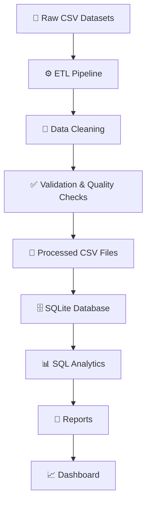
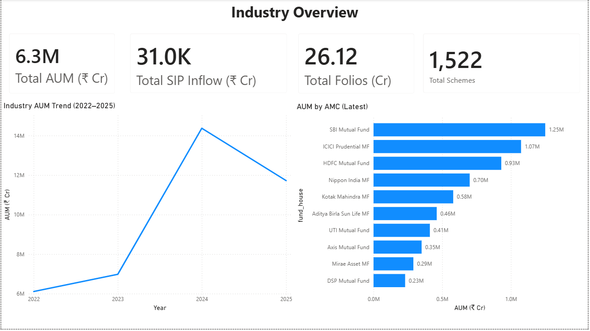
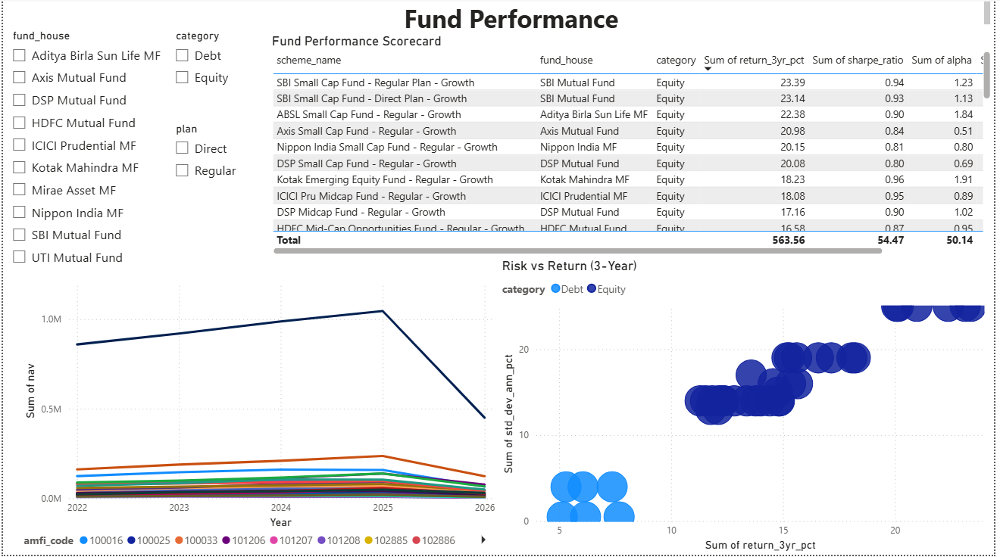
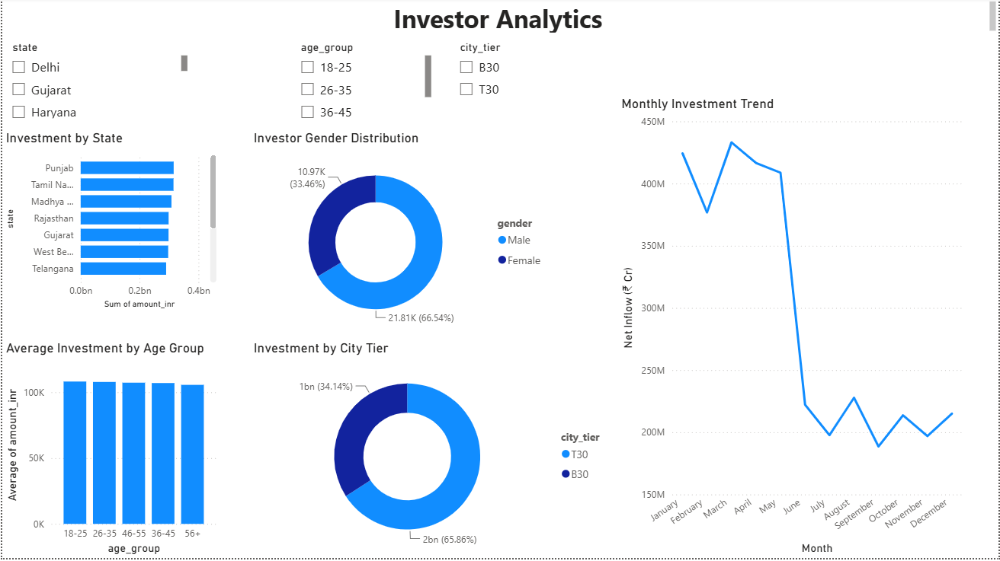
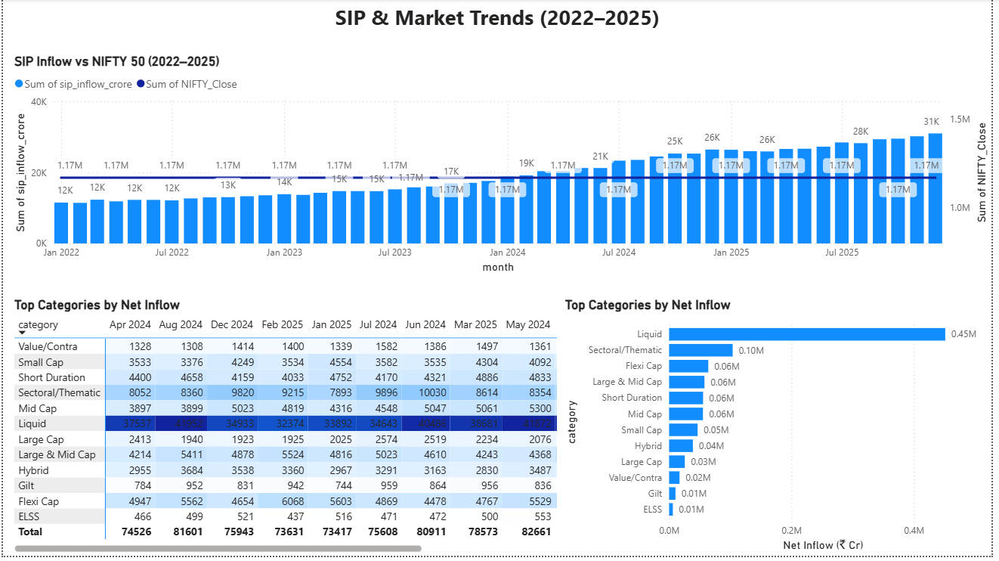

<p align="center">
  
</p>

<p align="center">


</p>

<h1 align="center">FundSight</h1>

<p align="center">
Mutual Fund Analytics Platform
</p>

<p align="center">
<i>From Raw Mutual Fund Data to Business Intelligence</i>
</p>

FundSight is an end-to-end Mutual Fund Analytics Platform developed as part of the Bluestock Fintech Data Analyst Capstone Project. It integrates data engineering, exploratory data analysis, financial performance analytics, and business intelligence to transform raw mutual fund datasets into actionable investment insights. The platform features a modular ETL pipeline, SQLite analytical database, SQL reporting, advanced risk metrics, and an interactive Power BI dashboard for comprehensive mutual fund analysis.

<p align="center">

🚀 **Project Status:** **Day 5 Completed** | 🔄 **Currently Working on Day 6 – Advanced Analytics**

</p>

---

## 📑 Table of Contents

- [💡 Why FundSight?](#-why-fundsight)
- [✨ Key Highlights](#-key-highlights)
- [🚀 Features](#-features)
- [🏛️ System Architecture](#️-system-architecture)
- [📂 Project Structure](#-project-structure)
- [🔄 ETL Workflow](#-etl-workflow)
- [🛠️ Tech Stack](#️-tech-stack)
- [📊 Current Progress](#-current-progress)
- [📈 Generated Outputs](#-generated-outputs)
- [📸 Screenshots](#-screenshots)
- [▶️ Getting Started](#️-getting-started)
- [📌 Roadmap](#-roadmap)
- [📄 Documentation](#-documentation)
- [📜 License](#-license)
- [🤝 Contributions](#-contributions)
- [👨‍💻 Author](#-author)

---

## 💡 Why FundSight?

FundSight demonstrates an end-to-end data analytics workflow for mutual fund analytics. The project showcases how raw financial datasets can be transformed into reliable, analysis-ready insights through a robust ETL pipeline, SQL-based data modeling, exploratory data analysis, financial performance analytics, and interactive business intelligence dashboards. It bridges the gap between raw financial data and data-driven investment decision-making.

---

## ✨ Key Highlights

- 📈 End-to-end ETL pipeline for mutual fund analytics
- 🧹 Automated data cleaning, preprocessing, and data quality validation
- 🗄️ SQLite analytical database with star schema design
- 📊 Comprehensive Exploratory Data Analysis (EDA) with insightful visualizations
- 📉 Financial performance analytics including CAGR, Sharpe Ratio, Sortino Ratio, Alpha, Beta, and Maximum Drawdown
- 📚 SQL-based business reporting and analytical queries
- 📊 Interactive 4-page Power BI dashboard with KPI cards, slicers, and drill-down analysis
- 📌 Business insights on NAV trends, AUM growth, SIP inflows, investor demographics, and benchmark performance

---

# 🚀 Features

* ✅ Automated ingestion of mutual fund datasets from multiple sources
* ✅ Robust ETL pipeline for data extraction, transformation, and loading
* ✅ Data cleaning, preprocessing, and quality validation using Pandas
* ✅ SQLite analytical database with star schema design
* ✅ SQL-based analytical queries and business reporting
* ✅ Exploratory Data Analysis (EDA) with interactive and statistical visualizations
* ✅ Financial performance analytics including CAGR, Sharpe Ratio, Sortino Ratio, Alpha, Beta, and Maximum Drawdown
* ✅ Benchmark comparison and mutual fund performance evaluation
* ✅ Investor demographic and transaction behavior analysis
* ✅ Interactive 4-page Power BI dashboard with KPI cards, slicers, and drill-through analysis
* ✅ Dashboard-ready datasets for business intelligence and reporting
* ✅ Modular project architecture for scalable analytics workflows

---

# 🏛️ System Architecture



This project follows a modular ETL architecture where raw mutual fund datasets are ingested, cleaned, validated, and transformed into analysis-ready datasets before being loaded into a SQLite analytical database. The processed data powers SQL-based business reporting, financial performance analytics, exploratory data analysis, and an interactive Power BI dashboard, enabling data-driven investment insights.

---

# 📂 Project Structure

```text
fundsight-mutual-fund-analytics/
│
├── assets/
│   └── banner.png
│
├── charts/
│   ├── aum_growth.png
│   ├── benchmark_comparison.png
│   ├── category_heatmap.png
│   ├── city_tier_distribution.png
│   ├── correlation.png
│   ├── demographics.png
│   ├── folio_growth.png
│   ├── nav_trend.png
│   ├── sector_donut.png
│   ├── sip_inflow_trend.png
│   ├── sip_trend.png
│   └── state_distribution.png
│
├── dashboard/
│   ├── bluestock_mf_dashboard.pbix
│   ├── charts.py
│   ├── demographics.png
│   ├── gender_distribution.png
│   ├── sharpe_ratio.png
│   └── state_investment.png
│
├── data/
│   ├── raw/
│   │   ├── 01_fund_master.csv
│   │   ├── 02_nav_history.csv
│   │   ├── 03_aum_by_fund_house.csv
│   │   ├── 04_monthly_sip_inflows.csv
│   │   ├── 05_category_inflows.csv
│   │   ├── 06_industry_folio_count.csv
│   │   ├── 07_scheme_performance.csv
│   │   ├── 08_investor_transactions.csv
│   │   ├── 09_portfolio_holdings.csv
│   │   └── 10_benchmark_indices.csv
│   │
│   └── processed/
│       ├── clean_nav.csv
│       ├── clean_performance.csv
│       ├── clean_transactions.csv
│       ├── daily_returns.csv
│       ├── cagr_comparison.csv
│       ├── alpha_beta.csv
│       ├── sharpe_ranking.csv
│       ├── sortino_ranking.csv
│       ├── tracking_error.csv
│       └── fund_scorecard.csv
│
├── docs/
│   ├── data_dictionary.md
│   ├── data_quality_summary.md
│   └── day1_todo.md
│
├── etl/
│   ├── data_ingestion.py
│   ├── amfi_validation.py
│   ├── fetch_multiple_navs.py
│   ├── live_nav_fetch.py
│   ├── clean_nav.py
│   ├── clean_transactions.py
│   ├── clean_performance.py
│   ├── load_to_sqlite.py
│   ├── verify_row_counts.py
│   └── check_db.py
│
├── notebooks/
│   ├── EDA_Analysis.ipynb
│   └── Performance_Analytics.ipynb
│
├── reports/
│   ├── dashboard_images/
│   │   ├── 01_Industry_Overview.png
│   │   ├── 02_Fund_Performance.png
│   │   ├── 03_Investor_Analytics.png
│   │   └── 04_SIP_Market_Trends.png
│   │
│   ├── Dashboard.pdf
│   ├── analytics.py
│   ├── sql_queries.sql
│   ├── top_alpha.csv
│   ├── top_sharpe.csv
│   ├── investor_demographics.csv
│   ├── gender_distribution.csv
│   └── state_investment.csv
│
├── sql/
│   ├── schema.sql
│   └── star_schema.sql
│
├── fundsight.db
├── requirements.txt
└── README.md
```


---

# 🔄 ETL Workflow

```text
Raw Mutual Fund Data
        │
        ▼
Data Ingestion
        │
        ▼
Data Cleaning & Validation
        │
        ▼
Processed CSV Files
        │
        ▼
SQLite Database
        │
        ▼
Analytical SQL Queries
        │
        ▼
Analytics Reports
        │
        ▼
Dashboard Visualizations
```

---

# 🛠️ Tech Stack

| Category | Technology |
|----------|------------|
| Programming Language | Python 3 |
| Data Processing | Pandas, NumPy |
| Database | SQLite |
| ORM / Database Access | SQLAlchemy |
| Query Language | SQL |
| Data Visualization | Matplotlib, Seaborn, Plotly |
| Business Intelligence | Power BI |
| Development Environment | Jupyter Notebook, VS Code |
| Documentation | Markdown |
| Version Control | Git & GitHub |

---

## 📊 Project Milestones

## ✅ Day 1 – Project Setup & Data Ingestion

- Established the project structure following industry best practices.
- Collected and organized mutual fund datasets from multiple sources.
- Implemented the initial data ingestion pipeline.
- Performed dataset profiling and validation.
- Documented the data dictionary and data quality summary.

---

## ✅ Day 2 – ETL Pipeline & Database Development

- Developed modular ETL scripts for data cleaning and preprocessing.
- Cleaned NAV history, investor transactions, and scheme performance datasets.
- Applied business rule validations and anomaly detection.
- Loaded processed datasets into a SQLite analytical database.
- Designed a star schema for efficient analytical querying.
- Verified database integrity through automated row count validation.

---

## ✅ Day 3 – Exploratory Data Analysis (EDA)

Generated comprehensive visualizations and business insights including:

- 📈 NAV Trend Analysis
- 💰 AUM Growth Analysis
- 📊 SIP Inflow Trend Analysis
- 🔥 Category Inflow Heatmap
- 👥 Investor Demographics
- 🌍 State & City Tier Distribution
- 📉 Correlation Analysis
- 🥧 Sector Allocation Analysis
- 📂 Folio Growth Trends

---

## ✅ Day 4 – Fund Performance Analytics

Implemented advanced mutual fund performance metrics:

- 📊 Daily Return Calculation
- 📈 CAGR Comparison
- ⚖️ Sharpe Ratio
- 📉 Sortino Ratio
- 📌 Alpha & Beta Analysis
- 📉 Tracking Error Analysis
- 🏆 Fund Scorecard Generation
- 📋 Benchmark Performance Comparison

Generated multiple analytical reports and performance datasets for dashboard integration.

---

## ✅ Day 5 – Interactive Dashboard Development

Designed and developed a comprehensive **4-page Power BI dashboard** consisting of:

- 📊 Industry Overview
- 📈 Fund Performance
- 👥 Investor Analytics
- 💹 SIP & Market Trends

Dashboard features include:

- KPI Cards
- Interactive Filters & Slicers
- Drill-down Analysis
- Dynamic Visualizations
- Business Insight Reporting

---

# 📈 Generated Outputs

The FundSight analytics pipeline generates the following outputs:

### 📂 Processed Datasets

- Cleaned NAV history
- Cleaned investor transactions
- Cleaned scheme performance
- Daily returns dataset
- CAGR comparison dataset
- Alpha & Beta analysis
- Sharpe Ratio rankings
- Sortino Ratio rankings
- Tracking Error analysis
- Fund scorecard

---

### 📊 Analytical Reports

- SQL analytical reports
- Benchmark comparison reports
- Investor demographic summaries
- State-wise investment analysis
- Top Alpha funds
- Top Sharpe Ratio funds

---

### 📈 Data Visualizations

- NAV Trend Analysis
- AUM Growth Analysis
- SIP Trend Analysis
- Category Inflow Heatmap
- Investor Demographics
- Correlation Analysis
- Sector Allocation
- Folio Growth Analysis
- Benchmark Comparison

---

### 📊 Business Intelligence Dashboard

- Interactive Power BI Dashboard (.pbix)
- Dashboard PDF Report
- Dashboard Screenshots
- KPI Cards & Performance Metrics
- Dashboard-ready datasets

---

# 📸 Screenshots
The Power BI dashboard consists of four interactive pages designed to provide comprehensive insights into mutual fund performance, investor behavior, and market trends.

## 📊 Industry Overview

<p align="center">

</p>

---

## 📈 Fund Performance

<p align="center">

</p>

---

## 👥 Investor Analytics

<p align="center">

</p>

---

## 💹 SIP & Market Trends

<p align="center">

</p>

---


# ▶️ Getting Started

Follow the steps below to set up and run the FundSight project locally.

## 1️⃣ Clone the Repository

```bash
git clone https://github.com/krishnavasnani07/fundsight-mutual-fund-analytics.git

cd fundsight-mutual-fund-analytics
```

---

## 2️⃣ Create a Virtual Environment

### Windows

```bash
python -m venv .venv
.venv\Scripts\activate
```

### Linux / macOS

```bash
python3 -m venv .venv
source .venv/bin/activate
```

---

## 3️⃣ Install Dependencies

```bash
pip install -r requirements.txt
```

---

## 4️⃣ Run the ETL Pipeline

```bash
# Step 1: Download and prepare datasets
python etl/data_ingestion.py

# Step 2: Validate AMFI codes
python etl/amfi_validation.py

# Step 3: Fetch latest NAV data
python etl/live_nav_fetch.py

# Step 4: Clean NAV history
python etl/clean_nav.py

# Step 5: Clean investor transactions
python etl/clean_transactions.py

# Step 6: Clean scheme performance
python etl/clean_performance.py

# Step 7: Load processed data into SQLite
python etl/load_to_sqlite.py

# Step 8: Verify database integrity
python etl/verify_row_counts.py
```

---

## 5️⃣ Explore the Project

After running the ETL pipeline, you can:

- Open `notebooks/EDA_Analysis.ipynb` for exploratory data analysis.
- Open `notebooks/Performance_Analytics.ipynb` for financial performance metrics.
- Open `dashboard/bluestock_mf_dashboard.pbix` in Power BI Desktop to explore the interactive dashboard.

---

# 📌 Roadmap

## ✅ Completed

* [x] Project setup
* [x] Data ingestion pipeline
* [x] ETL pipeline
* [x] Data cleaning & preprocessing
* [x] Data quality validation
* [x] SQLite analytical database
* [x] Star schema design
* [x] SQL analytics & reporting
* [x] Exploratory Data Analysis (EDA)
* [x] Financial performance analytics
* [x] Benchmark comparison
* [x] Interactive Power BI dashboard
* [x] Dashboard screenshots & reports

## 🚧 In Progress

* [ ] Advanced analytics & risk metrics
* [ ] Final project documentation
* [ ] Project presentation
* [ ] Final capstone submission

---

# 📄 Documentation

Additional documentation is available in the **docs/** directory:

- 📘 Data Dictionary
- 📗 Data Quality Summary
- 📝 Development Notes

---

# 📜 License

This repository is maintained for educational and portfolio purposes. Please refer to the internship agreement for any applicable intellectual property or usage restrictions.

---

# 🤝 Contributions

This repository is currently maintained by the author as part of a mutual fund analytics capstone project.

---

## 👨‍💻 Author

**Krishna Vasnani**

Computer Science Engineer | Data Engineering & Software Development Enthusiast

GitHub: [@krishnavasnani07](https://github.com/krishnavasnani07)

---

⭐ If you found this project useful, consider giving it a star. Feedback and suggestions are always welcome!